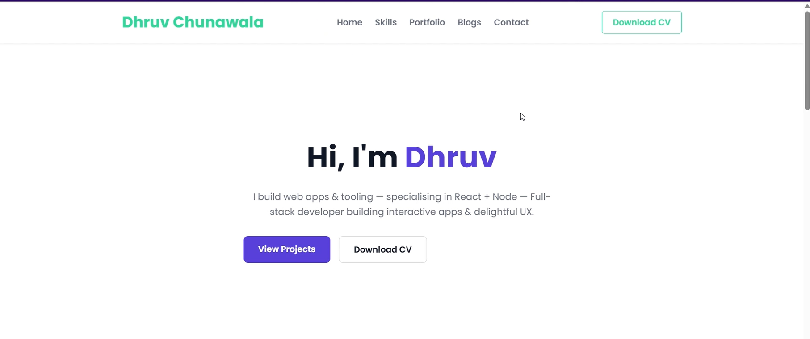

# EazyByts

Portfolio with CMS

- **Frontend**: HTML, CSS, JavaScript, React.js  
- **Backend**: Node.js, Express.js  
- **Database**: MySQL

<video src="demo.mp4" width="100%" controls autoplay loop></video>

## 📽️ Demo

